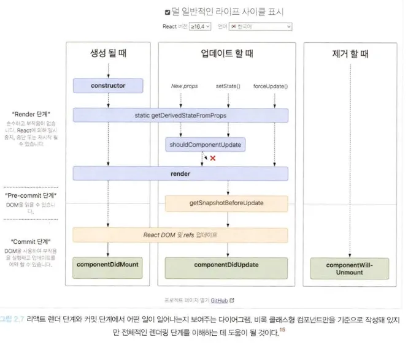

## JSX란?

- 자바스크립트 표준 코드가 아닌 페이스북이 임의로 만든 새로운 문법이므로 반드시 `트랜스파일러`를 거쳐야 비로소 자바스크립트 런타임이 이해할 수 있는 의미 있는 자바스크립트 코드로 변환됨
- JSX의 설계 목적은 다양한 트랜스파일러에서 다양한 속성을 가진 트리 구조를 토큰화해 ECMAScript로 변환하는 데 초점을 두고 있음. 즉, JSX 내부에 트리 구조로 표현하고 싶은 다양한 것들을 작성해두고, 이 JSX를 트랜스파일이라는 과정을 거쳐 자바스크립트가 이해할 수 있는 코드로 변경하는 것과 같음

### JSX의 정의

- JSX는 기본적으로 JSXElement, JSXAttributes, JSXChildren, JSXString이라는 4가지 컴포넌트를 기반으로 구성됨

1. JSXElement

- JSX를 구성하는 가장 기본 요소로, HTML의 요소(element)와 비슷한 역할을 수행
- 해당되기 위해선 아래 형태 중 하나여야함
  - JSXOpeningElement: 일반적으로 볼 수 있는 요소로, JSXOpeningElement로 시작했다면 후술할 JSXClosingElement가 동일한 요소로 같은 단계에서 선언돼 있어야 올바른 JSX 문법으로 간주됨
  - JSXClosingElement: JSXOpeningElement가 종료됐음을 알리는 요소로, 반드시 JSXOpeningElement와 쌍으로 사용되어야 함
  - JSXSelfClosingElement: 요소가 시작되고 스스로 종료되는 형태를 의미. `<script />`와 동일한 모습을 띠고 있으며 내부적으로 자식을 포함할 수 없는 형태를 의미
    - JSXFragment: 아무런 요소가 없는 형태로, JSXSelfClosingElement 형태를 띨 수는 없다. `</>`는 불가능하나, 단 `<></>`는 가능함
- JSXElementName
  - JSXElement의 요소 이름으로 쓸 수 있는 것을 의미하며, 이름으로 가능한 것은 아래와 같음
    - JSXIdentifier: JSX 내부에서 사용할 수 있는 식별자를 의미. 자바스크립트 식별자 규칙과 동일함
    - JSXNamespacedName: `:`을 통해 서로 다른 식별자를 이어주는 것도 하나의 식별자로 취급되며, `:`로 묶을 수 있는 것은 한 개 뿐이고 두 개 이상은 올바른 식별자로 취급되지 않음
    - JSXMemberExpression: JSXIdentifeir.JSXIdentifier의 조합. 즉, `.`을 통해 서로 다른 식별자를 이어주는 것도 하나의 식별자로 취급됨

1. JSXAttributes

- JSXElement에 부여할 수 잇는 속성을 의미하며, 단순히 속성을 의미하기 때문에 모든 경우에서 필수값이 아니므로 존재하지 않아도 에러가 나지 않음

1. JSXChildren

- JSXElement의 자식 값을 나타냄
  - JSXChild: JSXChildren을 이루는 기본 단위로, JSXChildren은 JSXChild가 없어도 상관없음

1. JSXString

- HTML에서 사용 가능한 문자열은 모두 JSXStrings에서도 사용이 가능하며, 정의된 문자열은 큰따옴표로 구성된 문자열 혹은 작은따옴표로 구성된 문자열 혹은 JSXText를 의미

### JSX는 어떻게 자바스크립트에서 변환될까?

```jsx
const ComponentA = <A required={true}>Hello World</A>;
const ComponentB = <>Hello World</>;
const ComponentC = (
  <div>
    <span>hello world</span>
  </div>
);
```

`@babel/plugin-transform-react-jsx`로 변환한 결과는 아래와 같음

```jsx
var ComponentA = React.createElement(
  A,
  {
    required: true,
  },
  "hello world"
);
var ComponentB = React.createElement(React.Fragment, null, "hello world");
var ComponentC = React.createElement(
  "div",
  null,
  React.createElement("span", null, "hello world")
);
```

- 두 결과물에 약간의 차이가 있지만 아래와 같은 공통점이 존재
  - JSXElement를 첫 번째 인수로 선언해 요소를 정의
  - 옵셔널인 JSXChildren, JSXAttributes, JSXStrigns는 이후 인수로 넘겨주어 처리
- 이러한 점을 활용하면 경우에 따른 JSXElement 렌더링 시 굳이 요소 전체를 감싸지 않더라도 처리가 가능함. 이는 곧 JSXElement만 다르고, JSXAttributes, JSXChildren이 완전히 동일한 상황에서 중복 코드를 최소화할 수 있음

  ```jsx
  import { createElement, PropsWithChildren } from "react";

  // ❌ props 여부에 따라 children 요소만 달라지는 경우
  // 굳이 번거롭게 전체 내용을 삼한 연산자로 처리할 필요가 없음
  // 이 경우 불필요한 코드 중복이 발생
  function TextOrHeading({
    isHeading,
    children,
  }: PropsWithChildren<{ isHeading: boolean }>) {
    return isHeading ? (
      <h1 className="text">{children}</h1>
    ) : (
      <span className="text">{children}</span>
    );
  }

  // ⭕️ JSX가 변환되는 특성을 활용하면 아래와 같이 간결하게 처리됨
  import { createElement } from "react";

  function TextOrHeading({
    isHeading,
    children,
  }: PropsWithChildren<{ isHeading: boolean }>) {
    return createElement(
      isHeading ? "h1" : "span",
      { className: "text" },
      children
    );
  }
  ```

  ⇒ JSX 반환값이 결국 React.createElement로 귀결되는 사실을 파악하면 이런 식으로 쉽게 리팩터링이 가능해짐

## 가상 DOM과 리액트 파이버

### DOM과 브라우저 렌더링 과정

- 브라우저가 웹사이트 접근 요청시 화면을 그리는 과정
  1. 브라우저가 사용자가 요청한 주소를 방문해 HTML 파일을 다운로드함
  2. 브라우저의 렌더링 엔진은 HTML을 파싱해 DOM 노드로 구성된 트리(DOM)를 만듦
  3. b번 과정에서 CSS 파일을 만나면 해당 CSS 파일도 다운로드함
  4. 브라우저의 렌더링 엔진은 이 CSS도 파싱해 CSS 노드로 구성된 트리(CSSOM)를 만듦
  5. 브라우저는 b번에서 만든 DOM 노드를 순회하는데, 여기서 모든 노드를 방문하는 것이 아닌 사용자 눈에 보이는 노드만 방문함. 즉, `display: none` 과 같이 사용자 화면에 보이지 않는 요소는 방문해 작업하지 않는데, 이는 트리를 분석하는 과정을 조금이라도 빠르게 하기 위함
  6. e번에서 제외된 눈에 보이는 노드를 대상으로 해당 노드에 대한 CSSOM 정보를 찾고 여기서 발견한 CSS 스타일 정보를 이 노드에 적용함. 이 DOM 노드에 CSS를 적용하는 과정은 크게 두 가지로 나눌 수 있음
     - 레이아웃(layout, reflow): 각 노드가 브라우저 화면의 어느 좌표에 정확히 나타나야 하는지 계산하는 과정으로, 이 레이아웃 과정을 거치면 반드시 페인팅 과정도 거치게 됨
     - 페인팅(painting): 레이아웃 단계를 거친 노드에 색과 같은 실제 유효한 모습을 그리는 과정
       
- 이렇게 모든 단계를 거친 최종 출력물은 웹 애플리케이션의 모든 콘텐츠와 스타일 정보를 갖게 됨

### 가상 DOM의 탄생 배경

- 특정한 요소의 색상이 변경되는 경우는 `페인팅`만 일어나므로 비교적 빠르게 처리가 가능함
- 특정한 요소의 노출 여부가 변경되거나 사이즈가 변경되는 등 요소의 위치와 크기를 재계산하는 경우, `레이아웃`이 일어나고, 이 `레이아웃`은 필연적으로 `리페인팅`이 발생하기 때문에 더 많은 비용이 듦. 또한 DOM 변경이 일어나는 요소가 많은 자식 요소를 가지고 있는 경우에는 하위 자식 요소도 덩달아 변경돼야 하기 때문에 더 많은 비용을 브라우저와 사용자가 지불하게 됨
- `가상 DOM(Document Object Model)`
  - 실제 브라우저의 DOM이 아닌 리액트가 관리하는 가상의 DOM을 의미
  - 가상 DOM은 웹 페이지가 표시해야 할 DOM을 일단 메모리에 저장하고 리액트가 실제 변경에 대한 준비가 완료됐을 때 실제 브라우저의 DOM에 반영함
  - 인터랙션에 따른 DOM의 최종 결과물과 비교하여 DOM의 변경 사항을 쉽게 추적할 수 있게 됨

### 가상 DOM을 위한 아키텍처, 리액트 파이버(React Fiber)

- 가상 DOM과 렌더링 과정 최적화를 가능하게 해주는 것으로, 리액트에서 관리하는 평범한 자바스크립트 객체임
- 파이버는 파이버 재조정자(fiber reconciler)가 관리하는데, 가상 DOM과 실제 DOM을 비교해 변경 사항을 수집하며, 만약 이 둘 사이에 차이가 있으면 변경에 관련된 정보를 가지고 있는 파이버를 기준으로 화면에 렌더링을 요청하는 역할을 함
  - 재조정은 리액트에서 어떤 부분을 새롭게 렌더링해야 하는지 가상 DOM과 실제 DOM을 비교하는 작업(알고리즘)과 같음
- 리액트 파이버의 **목표**는 리액트 웹 애플리케이션에서 발생하는 애니메이션, 레이아웃, 그리고 사용자 인터랙션에 올바른 결과물을 만드는 **반응성 문제를 해결**하는 것으로, 이를 위해 아래와 같은 일을 할 수 있음
  - 작업을 작은 단위로 분할하고 쪼갠 다음, 우선순위를 매김
  - 이러한 작업을 일시 중지하고 나중에 다시 시작할 수 있음
  - 이전에 했떤 작업을 다시 재사용하거나 필요하지 않은 경우에는 폐기 가능
- 이러한 모든 과정은 **비동기**로 일어남
- 파이버의 구현은 하나의 작업 단위로 구성되어 있는데, 리액트는 이러한 작업 단위를 하나씩 처리하고 finishedWork()라는 작업으로 마무리함. 그리고 해당 작업을 커밋해 실제 브라우저 DOM에 가시적인 변경 사항을 만들어 내고 이러한 단계는 아래 두 단계로 나눌 수 있음
  - 렌더 단계에서 리액트는 사용자에게 노출되지 않는 모든 비동기 작업을 수행함. 그리고 이 단계에서 앞서 언급한 파이버의 작업, 우선순위를 지정하거나 중지시키거나 버리는 등의 작업이 발생
  - 커밋 단계에서는 앞서 언급한 것처럼 DOM에 실제 변경 사항을 반영하기 위한 작업, commitWork()가 실행되는데, 이 과정은 앞서와 다르게 동기식으로 일어나고 중단될 수도 없음
- 파이버는 컴포넌트가 최초로 마운트되는 시점에 생성되어 이후에는 가급적이면 재사용됨
- 리액트 컴포넌트에 대한 정보를 1:1로 갖고 있는 것이 파이버와 같음
- `리액트 파이버 트리`
  - 파이버 트리는 리액트 내부에서 두 개가 존재하며, 하나는 현재 모습을 담은 파이버 트리이고, 다른 하나는 작업 중인 상태를 나타내는 workInProgress 트리임
  - 리액트 파이버의 작업이 끝나면 리액트는 단순힌 포인터만 변경해 workInProgrss 트리를 현재 트리로 바꿔버리며, 이런 기술을 **더블 버퍼링**이라 함
  - 더블 버퍼링은 리액트에서 미처 다 그리지 못한 모습을 노출시키지 않기 위해 사용하며, 커밋 단계에서 수행됨
  - 즉, 먼저 현재 UI 렌더링을 위해 존재하는 트리인 current를 기준으로 모든 작업이 시작됨. 여기에서 만약 업데이트가 발생하면 파이버는 리액트에서 새로 받은 데이터로 새로운 workInProgress 트리를 빌드하기 시작함.<br />이 workInProgress 트리를 빌드하는 작업이 끝나면 다음 렌더링에 이 트리를 사용하며, 이 workInProgress 트리가 UI에 최종적으로 렌더링되어 반영이 완료되면 current가 이 workInProgress로 변경됨
- `파이버의 작업 순서`
  1. 리액트는 beginWork() 함수를 실행해 파이버 작업을 수행하는데, 더 이상 자시깅 없는 파이버를 만날 때까지 트리 형식으로 시작됨
  2. a번에서 작업이 끝난다면 그 다음 completeWork() 함수를 실행해 파이버 작업을 완료함
  3. 형제가 있다면 형제로 넘어감
  4. b번, c번이 모두 끝났다면 return으로 돌아가 자신의 작업이 완료됐음을 알림

## 클래스형 컴포넌트와 함수형 컴포넌트

- 함수형 컴포넌트에 훅이 등장한 이후 함수형 컴포넌트에서 상태나 생명주기 메서드 비슷한 작업 흉내가 가능해져서 클래스형 컴포넌트보다 인지도가 올라가게 됨

### 클래스형 컴포넌트

- 기본적으로 클래스를 선언하고 `extends`로 만들고 싶은 컴포넌트를 extends 해야하며, extends 구문에 넣을 수 있는 클래스는 아래와 같음
  - React.Component
  - React.PureComponent
- 생명주기 메서드가 실행되는 시점은 아래와 같이 크게 3가지로 나눌 수 있음
  - `마운트(mount)`: 컴포넌트가 마운팅(생성)되는 시점
  - `업데이트(update)`: 이미 생성된 컴포넌트의 내용이 변경(업데이트)되는 시점
  - `언마운트(unmount)`: 컴포넌트가 더 이상 존재하지 않는 시점
- **`render()`**
  - 생명주기 메서드 중 하나로, 리액트 클래스형 컴포넌트의 유일한 필수 값으로 항상 쓰이며, 이 함수는 컴포넌트가 UI를 렌더링하기 위해서 쓰임. 마운트와 업데이트 과정에서 일어남
  - render() 함수는 항상 순수해야 하며 부수 효과가 없어야함. 때문에 state를 직접 업데이트하는 `this.setState`를 호출해서는 안 되며, **state**를 변경하는 일은 클래스형 컴포넌트의 메서드나 다른 생명주기 메서드 내부에서 발생해야 함
- **`componentDidMount()`**
  - 클래스형 컴포넌트가 마운트되고 준비가 됐다면 그다음으로 호출되는 생명주기 메서드로, 컴포넌트가 마운트되고 준비되는 즉시 실행됨
  - render()와 다르게 이 함수 내부에서는 `this.setState()`로 **state** 값을 변경하는 것이 가능함
  - this.setState를 호출하면 state가 변경되고 그 즉시 다시 한번 렌더링을 시도하는데, 이 작업은 브라우저가 실제로 UI를 업데이트하기 전에 실행되어 사용자가 변경되는 것을 눈치챌 수 없게 만듦
  - this.setState를 허용하는 것은 **생성자 함수에서는 할 수 없는 것, API 호출 후 업데이트, DOM에 의존적인 작업(이벤트 리스너 추가 등)** 등을 하기 위해서이며, 꼭 componentDidMount에서 할 수밖에 없는 작업인지 철저히 확인해 보고 사용할 것
- **`componentDidUpdate()`**
  - 컴포넌트 업데이트가 일어난 이후 바로 실행되며, 일반적으로 **state**나 **props**의 변화에 따라 DOM을 업데이트하는 등에 쓰임
  - this.setState 사용이 가능하나 적절한 조건문으로 감싸지 않으면 this.setState가 계속해서 호출되는 일이 발생할 수 있음
- **`componentWillUnmount()`**
  - 컴포넌트가 언마운트되거나 더 이상 사용되지 않기 직전에 호출됨
  - 메모리 누수나 불필요한 작동을 막기 위한 클린업 함수를 호출하기 위한 최적의 위치로, 이 메서드 내에서는 `this.setState` 호출이 불가능함
- **`shouldComponentUpdate()`**
  - `state`나 `props`의 변경으로 리액트 컴포넌트가 다시 리렌더링되는 것을 막고 싶을 때 이 생명주기 메서드를 사용하면 됨
  - 기본적으로 `this.setState`가 호출되면 컴포넌트는 리렌더링을 일으키지만, 이 생명주기 메서드를 활용하면 컴포넌트에 영향을 받지 않는 변화에 대해 정의가 가능함
  - 일반적으로 state의 변화에 따라 컴포넌트가 리렌더링되는 것은 자연스러운 일이므로, **특정한 성능 최적화 상황**에서만 고려할 것을 추천
- **`getSnapShotBeforeUpdate()`**
  - 최근에 도입된 생명주기 메서드 중 하나로, `componentWillUpdate()`를 대체할 수 있는 메서드
  - **DOM이 업데이트되기 직전에 호출**됨
  - 반환된 값은 componentDidUpdate로 전달됨
  - DOM에 렌더링되기 전에 윈도우 크기를 조절하거나 스크롤 위치를 조정하는 등의 작업을 처리하는 데 유용
- 생명주기 메서드 정리
  
- **`getDerivedStateFromError()`**
  - 에러 상황에서 실행되는 메서드로, 자식 컴포넌트에서 에러가 발생했을 때 호출되는 에러 메서드임
  - 해당 에러 메서드를 사용하면 적절한 에러 처리 로직 구현이 가능함
- **`componentDidCatch`**
  - 자식 컴포넌트에서 에러가 발생했을 때 실행되며, `getDerviedStateFromError`에서 에러를 잡고 **state를 결정한 이후에 실행**됨
  - 두 개의 인수를 받는데, 첫 번째는 getDerivedStateFromError와 동일한 error, 그리고 정확히 어떤 컴포넌트가 에러를 발생시켰는지 정보를 갖고있는 info임
- 클래스형 컴포넌트의 한계
  - **데이터의 흐름을 추적하기 어려움**: state의 흐름을 추적하기 어려운데, 서로 다른 여러 메서드에서 state의 업데이트가 일어날 수 있기 때문
  - **애플리케이션 내부 로직의 재사용이 어려움**: 공통 로직이 많아질수록 이를 감싸는 고차 컴포넌트 내지는 props가 많아지는 래퍼 지옥에 빠져들 위험성이 커짐. extends PurComponent와 같이 컴포넌트 상속을 통한 중복 코드 관리도 가능하나, 상속되고 있는 클래스의 흐름을 쫓아야 하므로 복잡도가 증가한다는 단점이 존재
  - **기능이 많아질수록 컴포넌트의 크기가 커짐**: 컴포넌트 내부에 로직이 많아질수록 또 내부에서 처리하는 데이터 흐름이 복잡해져 생명주기 메서드 사용이 잦아지는 경우 컴포넌트의 크기가 기하급수적으로 커지는 문제 발생
  - **클래스는 함수에 비해 상대적으로 어려움**

### 함수형 컴포넌트

- render 내부에서 필요한 함수를 선언할 때 this 바인딩을 조심할 필요가 없음
- state는 객체가 아닌 각각의 원시값으로 관리되어 훨씬 사용하기가 편해짐

## 함수형 컴포넌트 vs 클래스형 컴포넌트

|                   | 생명주기 메서드 | 렌더링된 값 |
| ----------------- | --------------- | ----------- |
| 함수형 컴포넌트   | 존재 ⭕️        | 고정 ❌     |
| 클래스형 컴포넌트 | 존재 ❌         | 고정 ⭕️    |

- 클래스형 컴포넌트는 props의 값을 항상 this로부터 가져오므로, this가 가리키는 객체의 인스턴스의 멤버는 변경한 값이 됨

## 렌더링은 어떻게 일어나는가?

- 리액트의 렌더링은 브라우저가 렌더링에 필요한 DOM 트리를 만드는 과정과도 같으며, 리액트도 브라우저와 마찬가지로 이 렌더링 작업을 위한 자체적인 렌더링 프로세스가 있음

### 리액트의 렌더링이란?

- 리액트 애플리케이션 트리 안에 있는 모든 컴포넌트들이 현재 자신들이 가지고 있는 **props**와 **state**의 값을 기반으로 어떻게 UI를 구성하고 이를 바탕으로 어떤 DOM 결과를 브라우저에 제공할 것인지 계산하는 일련의 과정을 의미
- 만약 컴포넌트가 props와 state같은 상태값을 가지고 있지 않다면 오직 해당 컴포넌트가 반환하는 JSX 값에 기반해 렌더링이 발생

### 리액트의 렌더링이 일어나는 이유

1. **최초 렌더링**: 사용자가 청므 애플리케이션 진입시 당연히 렌더링해야 할 결과물이 필요함. 리액트는 브라우저에 이 정보를 제공하기 위해 최초 렌더링을 수행
2. **리렌더링**: 처음 애플리케이션에 진입했을 때 최초 렌더링이 발생한 이후로 발생하는 모든 렌더링을 의미하며, 리렌더링이 발생하는 경우는 아래와 같음
   - 클래스형 컴포넌트의 setState가 실행되는 경우: state의 변화는 컴포넌트 상태의 변화를 의미
   - 클래스형 컴포넌트의 forceupdate가 실행되는 경우: 클래스형 컴포넌트에서 렌더링을 수행하는 인스턴스 메서드인 render가 state나 props가 아닌 다른 값에 의존하고 있어 리렌더링을 자동으로 실행할 수 없는 경우에 해당
   - 함수형 컴포넌트의 useState()의 두 번째 배열 요소인 setter가 실행되는 경우: setState와 마찬가지로 state를 업데이트하는 함수이기 때문
   - 함수형 컴포넌트의 useReducer()의 두번째 배열 요소인 dispatch가 실행되는 경우: useReducer도 useState와 마찬가지로 상태와 이 상태를 업데이트하는 함수를 배열로 제공하기 때문
   - 컴포넌트의 key props가 변경되는 경우: 리액트에서 key는 리렌더링이 발생하는 동안 형제 요소들 사이에서 동일한 요소를 식별하는 값임

### 리액트의 렌더링 프로세스

1. 렌더링 프로세스가 시작되면 리액트는 컴포넌트의 루트에서부터 차근차근 아래쪽으로 내려가면서 업데이트가 필요하다고 지정되어 있는 모든 컴포넌트를 찾음
2. 업데이트가 필요하다고 지정된 컴포넌트 발견시 클래스형 컴포넌트의 경우에 클래스 내부의 `render()` 함수를 실행하게 되고, 함수형 컴포넌트의 경우에는 `FunctionComponent()` 그 자체를 호출한 뒤에 그 결과물을 저장함

- 일반적인 렌더링 결과물은 JSX 문법으로 구성돼 있고, 이것이 자바스크립트로 컴파일되면서 `React.createElement()`를 호출하는 구문으로 변환됨. 여기서 createElement는 브라우저의 UI 구조를 설명할 수 있는 일반적인 자바스크립트 객체를 반환
- 렌더링 프로세스가 실행되면서 이런 과정을 거쳐 각 컴포넌트의 렌더링 결과물을 수집한 다음, 리액트의 새로운 트리인 가상 DOM과 비교해 실제 DOM에 반영하기 위한 모든 변경 사항을 차례차례 수집함
- 이때, 리액트의 렌더링은 **렌더 단계**와 **커밋 단계**라는 총 두 단계로 분리되어 실행됨

### 렌더와 커밋

- `렌더 단계(Render Phase)`: 컴포넌트를 렌더링하고 변경 사항을 계산하는 모든 작업을 의미. 즉, 렌더링 프로세스에서 컴포넌트를 실행해(render() 또는 return)이 결과와 이전 가상 DOM을 비교하는 과정을 거쳐 변경이 필요한 컴포넌트를 체크하는 단계
  - 여기서 비교하는 것은 크게 **type**, **props**, **key** 세 가지며, 이 중 하나라도 변경된 것이 있으면 변경이 필요한 컴포넌트로 체크해둠
- `커밋 단계(Commit Phase)`: 렌더 단계의 변경 사항을 실제 DOM에 적용해 사용자에게 보여주는 과정을 의미하며, 이 단계가 끝나야 비로소 브라우저의 렌더링이 발생
- 리액트가 먼저 DOM을 커밋 단계에서 업데이트한다면 이렇게 만들어진 모든 DOM 노드 및 인스턴스를 가리키도록 리액트 내부의 참조를 업데이트함 → 그 다음, 생명주기 개념이 있는 클래스형 컴포넌트에서는 `componentDidMount`, `componentDidUpdate` 메서드를 호출하고, 함수형 컴포넌트에서는 `useLayoutEffect` 훅을 호출
- **리액트의 렌더링이 일어난다고 해서 무조건 DOM 업데이트가 일어나지 않음**에 주의할 것
  - 리액트의 렌더링은 꼭 가시적인 변경이 일어나지 않아도 발생할 수 있으며, 렌더링 과정 중 첫 번째 단계인 렌더 단계에서 변경 사항을 감지할 수 없다면 커밋 단계가 생략되어 브라우저의 DOM 업데이트가 일어나지 않을 수 있음
    
- 렌더링 과정이 길어질수록 애플리케이션의 성능 저하로 이어지고 결과적으로 그 시간만큼 브라우저의 다른 작업을 지연시킬 가능성이 존재함

- 컴포넌트를 렌더링하는 작업은 별도로 렌더링을 피하기 위한 조치가 돼 있지 않는 한 하위 모든 컴포넌트에도 영향을 미침
- 부모가 변경됐다면 props가 변경됐는지와 상관없이 무조건 자식 컴포넌트도 리렌더링 됨 → memo 처리해주면 렌더링이 생략되므로 커밋 단계 또한 생략이 됨

## 컴포넌트와 함수의 무거운 연산을 기억해 두는 메모이제이션

- 리액트에서 제공하는 API 중 useMemo, useCallback 훅과 고차 컴포넌트인 memo는 리액트에서 발생하는 렌더링을 최소한으로 줄이기 위해 제공됨

### 주장1: 섣부른 최적화는 독이다, 꼭 필요한 곳에만 메모이제이션을 추가하기

- 가벼운 작업 자체는 메모이제이션을 자바스크립트 메모리 어딘가에 두었다가 그것을 다시 꺼내오는 것보단 매번 작업을 수행해 결과를 반환하는 것이 더 빠를 수도 있음
- 메모이제이션에도 비용이 많이 듦 → **값을 비교하고 렌더링 또는 재계산이 필요한지 확인하는 작업**, 그리고 **이전에 결과물을 저장해 두었다가 다시 꺼내와야 한다**는 두 가지 비용이 존재함
- 메모이제이션은 항상 어느 정도의 트레이드 오프가 있는 기법이라고 보는 것이 옳음
  - 이전 결과를 캐시로 저장해 미래에 더 나은 성능을 위해 메모리를 차례대로 점유하게 됨
  - 렌더링도 비용이지만 메모리에 저장하는 것도 마찬가지로 비용임
- 개발자 도구나 useEffect를 사용해 실제로 어떻게 렌더링이 일어나고 있는지 확인하고 필요한 곳에서만 최적화하는 것이 옳음

### 주장2: 렌더링 과정의 비용은 비싸다, 모조리 메모이제이션 해버리자

- 잘못된 memo로 지불해야 하는 비용은 바로 props에 대한 얕은 비교가 발생하면서 지불해야 하는 비용
- 반면, memo를 하지 않았을 때 발생할 수 있는 문제는 아래와 같음
  - 렌더링을 함으로써 발생하는 비용
  - 컴포넌트 내부의 복잡한 로직의 재실행
  - 그리고 위 두 가지 모두가 모든 자식 컴포넌트에서 반복해서 일어남
  - 리액트가 구 트리와 신규 트리를 비교

<br />

---

### 추가 참고사항

- ErrorBoundary
- useEffect
